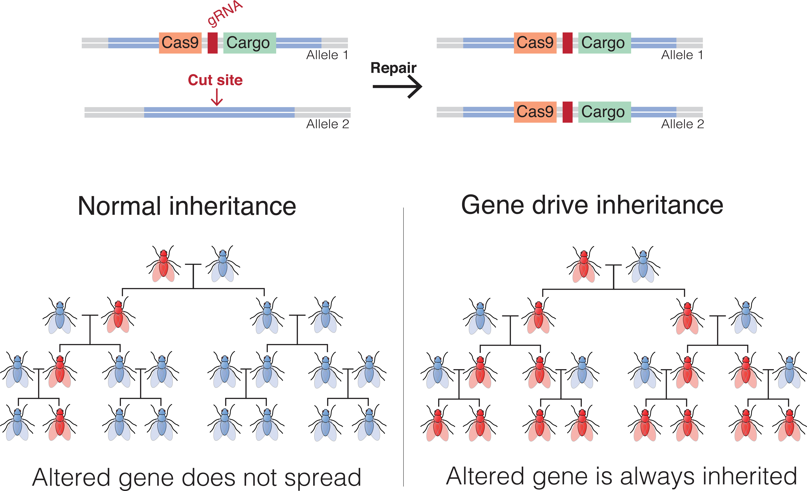

# Hi there 👋

I am a **Ph.D. Student** at the [Champer Lab](https://jchamper.github.io/), [Center for Life Sciences](http://www.cls.edu.cn/), [Peking University](https://www.pku.edu.cn/). I received a **B.Eng. in Bioinformatics** at [School of Life Sciences](https://www.bio.pku.edu.cn/), [Peking University](https://www.pku.edu.cn/) in 2024. I am interested in **computational modeling of gene drives**.

E-mail: <jyzhu_2020@stu.pku.edu.cn>.

## Research Interest

Gene drive alleles can bias their inheritance to rapidly spread through a population. Engineering gene drives can modify the population with desired traits or suppress the population. They are promising in combating vector-borne diseases such as malaria and dengue by preventing their transmission among the vector species. They are also useful in controlling agricultural pests and removing invasive species, thereby conserving target species.

Several technical problems must be addressed to implement and deploy effective gene drives. A key challenge is to develop high-effciency and robust gene drives by reducing the formation of resistance alleles and increasing the chance of drive conversion. Another consideration on gene drives is to make them "controllable", which means that the spread of the drive should only be in the target population, and preferably eliminated from the population once the release stops. This is especially important in terms of socialpolitical limitations.

Interdisciplinary approaches are involved in overcoming these challenges. While experimental methods are employed to construct and validate successful gene drives in model organisms like *Drosophila melanogaster* and other target species, computational modeling based on population genetics and ecology is especially important and irreplacable in predicting the dynamics of gene drives in the wild population over time, enabling the assessment of their potential impact and risks.

<figure>

<figcaption>Principle of gene drives, cited from <a href="https://en.wikipedia.org/wiki/Gene_drive" target="_blank">Wikipedia</a></figcaption>
</figure>

<figure>

<figcaption>Confinement of gene drives, cited from <a href="https://www.cell.com/trends/genetics/fulltext/S0168-9525(22)00040-3" target="_blank">Wang GH, <em>et al.</em> <em>Trends Genet</em> (2022)</a></figcaption>
</figure>

## Publications

("\*": equal contribution)

1. 🆕 **Zhu, J.\***, Chen, J.\*, Liu, Y.\*, *et al*. [Population suppression with dominant female-lethal alleles is boosted by homing gene drive](https://doi.org/10.1186/s12915-024-02004-x). *BMC Biol* **22**, 201 (2024). **[[Presentation slides]](static/Jinyu_ICE2024.pdf)**

## Projects

- **[Gene Drive Playground](https://jyzhu-pointless.github.io/Gene-drive-playground/)**, online interactive demonstrations of different gene drives.
- (developing) Maximum-likelihood estimation frameworks for measuring the genetic parameters of gene drives in *Anopheles* population.
